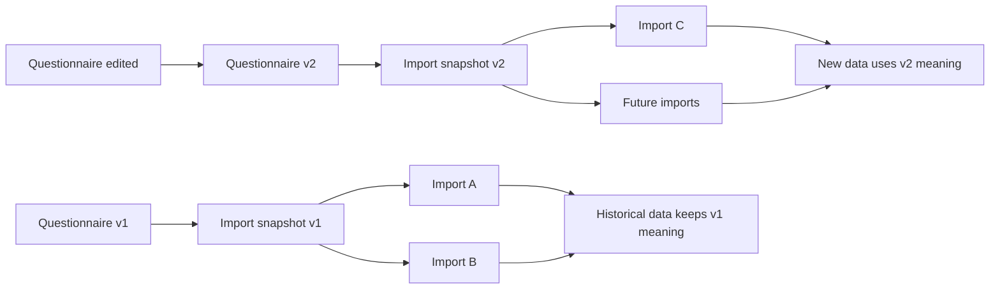
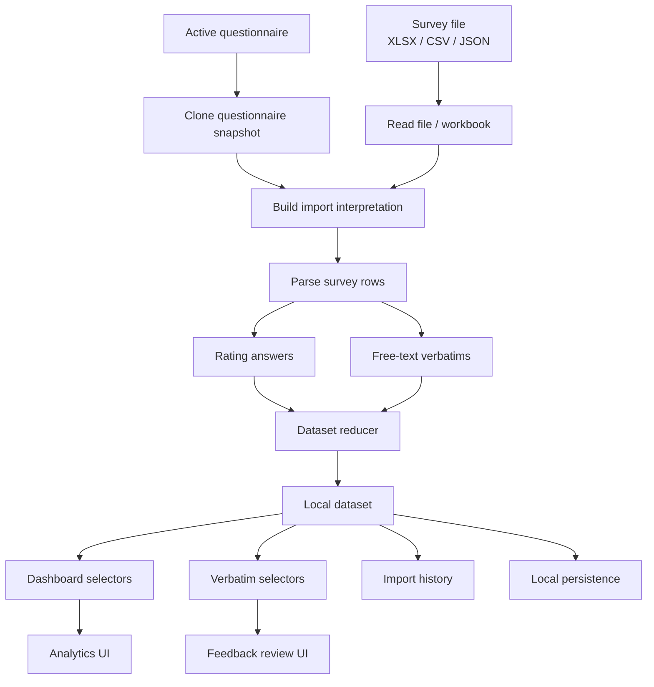
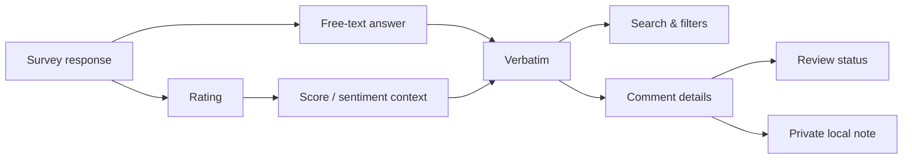
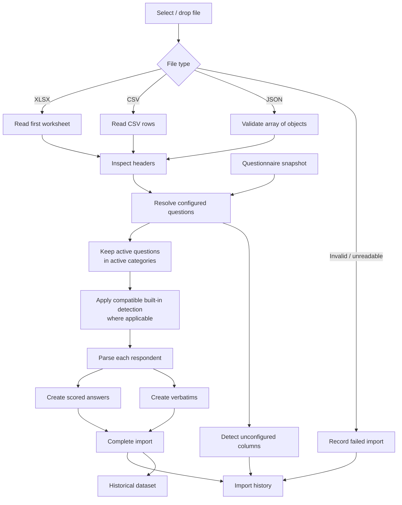
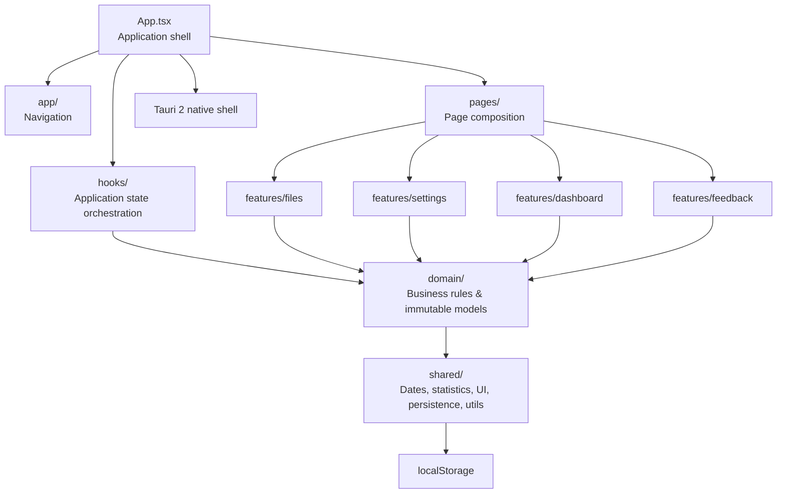
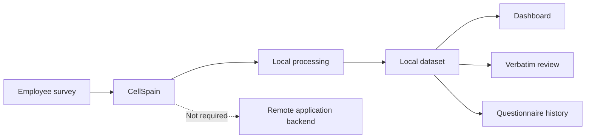
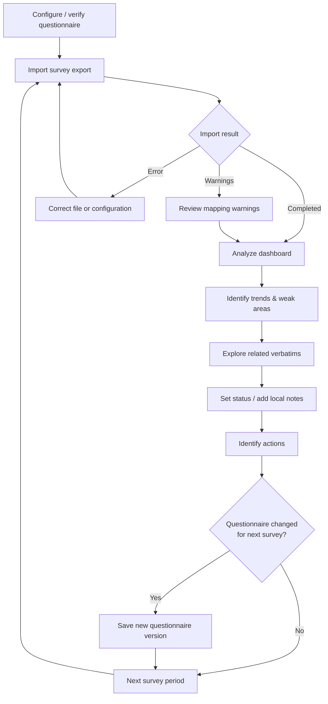

<div align="center">

# 📊 CellSpain

### Local-first employee survey analytics for evolving questionnaires

**Import survey exports, analyze satisfaction trends, explore employee verbatims, and evolve the questionnaire without rewriting historical data.**

<br />


</div>

---

## Overview

**CellSpain** is a desktop application for analyzing employee satisfaction survey exports.

It combines quantitative survey ratings with qualitative employee feedback in a single local application. Survey files can be imported, normalized, filtered by period, compared across quarters, and explored through dashboards and verbatim review tools.

The project is built around one important business rule:

> **A questionnaire may change between imports, but data that has already been imported must keep the meaning it had at import time.**

CellSpain therefore versions questionnaire configurations and binds every import to a configuration snapshot. Renaming a question, moving it to another category, disabling it, or changing the questionnaire structure only affects **future imports**.

---

## Table of Contents

- [Why CellSpain?](#why-cellspain)
- [Key Features](#key-features)
- [Core Business Rule: Historical Stability](#core-business-rule-historical-stability)
- [How Data Flows Through the App](#how-data-flows-through-the-app)
- [Dashboard & Analytics](#dashboard--analytics)
- [Verbatim Explorer](#verbatim-explorer)
- [Questionnaire Configuration](#questionnaire-configuration)
- [Import System](#import-system)
- [Architecture](#architecture)
- [Local Persistence & Privacy](#local-persistence--privacy)
- [Tech Stack](#tech-stack)
- [Project Structure](#project-structure)
- [Getting Started](#getting-started)
- [Development](#development)
- [Testing](#testing)
- [Design Principles](#design-principles)
- [Possible Next Steps](#possible-next-steps)
- [Author](#author)

---

# Why CellSpain?

Employee survey exports are rarely static forever.

Over time:

- questions are added or removed;
- wording changes;
- categories evolve;
- spreadsheet columns move;
- new free-text fields appear;
- old historical data still needs to remain comparable.

A hard-coded import pipeline quickly becomes fragile.

CellSpain solves this by separating:

1. **the questionnaire definition**;
2. **the imported historical data**;
3. **the analytics computed from that historical snapshot**.

This makes the application more resilient to future survey changes while protecting previous imports from retroactive reinterpretation.

---

# Key Features

## 📥 Multi-format survey imports

Import survey responses from:

```text
.xlsx
.csv
.json
```

Files can be added through:

- drag & drop;
- the native file picker.

For each import, CellSpain records metadata such as:

- file name;
- import date;
- file size;
- number of processed rows;
- number of detected verbatims;
- status;
- warnings;
- questionnaire configuration version.

Failed imports are also retained in the history so errors remain understandable instead of disappearing silently.

---

## 📊 Satisfaction analytics

The dashboard calculates analytics directly from imported answers.

Available views include:

- overall average score;
- median score;
- variation against the previous available quarter;
- average score by category;
- average score by employee seniority;
- satisfaction evolution over time;
- category-level trend lines;
- seniority-specific trends;
- radar comparison between consecutive periods.

Scores are represented on a **1–4 scale**.

The legacy mapping supports values such as:

| Survey value | Score |
|---|---:|
| `No way` / `No` | 1 |
| `Meh` / `Bof` | 2 |
| `OK` | 3 |
| `Great` / `Top` / `Top!` | 4 |

Numeric values between `1` and `4` are also supported.

---

## 📈 Interactive trend analysis

Trend charts are calculated by quarter and can display:

- overall satisfaction;
- all categories together;
- one selected category;
- a linear trend line for the selected series.

The dashboard automatically adapts its score axis to the visible data while keeping scores within the `0–4` range.

A dedicated seniority trend view can also filter the evolution by employee length of service.

---

## 🕸️ Period-to-period radar comparison

The radar view compares category scores between two consecutive survey periods.

Users can move backward and forward through available quarters to compare how the category profile changed over time.

The radar is shown when enough data exists to make the comparison meaningful.

---

## 🔎 Flexible date filtering

The dashboard and verbatim analysis share period filtering logic.

Supported modes:

```text
All data
Month
Year
Custom period
```

Filtering is applied to derived analytics rather than rewriting stored data.

---

## 💬 Verbatim Explorer

Free-text answers are extracted as individual verbatims.

A verbatim can preserve:

- comment text;
- original source question;
- category;
- associated score when available;
- derived sentiment;
- response date;
- employee role;
- seniority;
- source file;
- source sheet;
- import identifier;
- questionnaire configuration version.

Users can search and filter verbatims by:

- text query;
- sentiment;
- category;
- local review status;
- date period.

---

## ✅ Local feedback review workflow

Each verbatim has a local review status:

```text
New
To review
Done
Ignored
```

Users can also attach a private internal note to a comment.

This creates a lightweight review workflow directly inside the application without requiring an external task-management system.

---

## ⚙️ Configurable questionnaire

The questionnaire can evolve directly from the application.

### Categories

Users can:

- add categories;
- rename categories;
- add descriptions;
- enable or disable categories;
- delete categories.

Deleting a category also removes the questions linked to that category from the **next configuration version**.

### Questions

Each configured question contains:

```text
Stable technical identity
Display label
Expected source column
Category
Response type
Active / inactive state
Optional score mapping
```

Supported response types:

```text
Rating
Free text / verbatim
```

Source columns can be resolved using:

- their spreadsheet header;
- normalized header matching;
- Excel-style column references such as `B`, `U`, or `AA`.

---

## 🧬 Versioned questionnaire configurations

Every saved configuration creates a **new version**.

Old versions are kept in the dataset rather than being overwritten.

Questionnaire configurations can also be:

- exported to JSON;
- imported from JSON;
- validated before activation;
- reset to the initial legacy auto-detection mode.

Validation protects against issues such as:

- duplicate category keys;
- duplicate question keys;
- duplicate active source columns;
- questions linked to missing categories;
- malformed configuration files;
- invalid score mappings.

---

# Core Business Rule: Historical Stability

This is the most important rule in the project:

> **Changing the active questionnaire must never mutate, remap, or reinterpret already imported answers and verbatims.**

Every answer and verbatim stores the context it had when it was imported, including category/question information and its questionnaire configuration version.



For example:

```text
Questionnaire v1
"Are you satisfied with your manager?"
        ↓
Category: Management
```

Later:

```text
Questionnaire v2
"Are you satisfied with your manager?"
        ↓
Category: Work Environment
```

The result is:

```text
Old imports  → still categorized as "Management"
New imports  → categorized as "Work Environment"
```

No historical recalculation is performed.

---

# How Data Flows Through the App



The import action is bound to a cloned questionnaire snapshot before parsing begins.

That means a settings change occurring while files are being processed cannot accidentally rebind those files to another configuration.

---

# Dashboard & Analytics

The dashboard is built from derived selectors rather than storing duplicated analytics in the dataset.

## Global metrics

CellSpain computes:

```text
Average score
Median score
Average variation vs previous quarter
Median variation vs previous quarter
```

The variation is calculated from the two latest available periods in the current filtered dataset.

---

## Category scores

Responses are grouped by their historical category snapshot.

The interface displays the average score for each available category.

The initial legacy categories include:

```text
Work environment
Missions
Events
Development
Salary
POM
Material
Proudness
```

Once explicit questionnaire configuration is used, categories can evolve between future imports.

---

## Quarter-based trends

Dated answers are grouped into calendar quarters.

```text
Q1
Q2
Q3
Q4
```

The trend layer builds:

- an overall series;
- one series per category;
- chronologically sorted period points.

When a single series is selected and at least two points are available, CellSpain can calculate and display a linear trend overlay.

---

## Seniority analytics

When survey exports contain seniority information, CellSpain can calculate:

- average satisfaction by seniority;
- trend evolution for all seniority groups;
- trend evolution for one selected seniority group.

This helps highlight differences in experience across employee tenure.

---

# Verbatim Explorer

Quantitative scores answer:

> **What is changing?**

Verbatims help answer:

> **Why might it be changing?**



Sentiment is derived from the related score when one is available:

```text
3.5 – 4.0  → Positive
2.5 – 3.49 → Neutral
Below 2.5   → Negative
```

If no meaningful score can be associated with a comment, sentiment may remain unavailable.

---

# Questionnaire Configuration

## Legacy compatibility mode

The initial questionnaire starts in a compatibility mode using historical automatic detection.

This preserves behavior for existing data and older survey formats.

Once the user saves an explicit questionnaire configuration:

```text
Legacy auto-detection
        ↓
Save configuration
        ↓
New explicit questionnaire version
        ↓
Future imports use configured questions/categories
```

Historical imports remain untouched.

---

## Stable identities

Categories and questions use stable keys internally.

These identities allow the application to distinguish the logical entity from its current presentation.

For example, a future configuration may change:

- a display label;
- a category name;
- a source column;
- whether a question is active.

The historical imported answer still retains the snapshot from the version that produced it.

---

## Import / export

A configuration can be exported as:

```text
cellspain-questionnaire-v<version>.json
```

Imported configuration files are validated and activated as a **new version**.

Older exported files containing now-removed legacy properties are normalized where compatibility is supported.

---

# Import System

## Supported formats

### XLSX

For Excel workbooks, the survey parser reads the first worksheet.

### CSV

CSV content is parsed through the spreadsheet reader.

### JSON

JSON imports must contain an array of survey response objects.

Example shape:

```json
[
  {
    "Completion time": "2026-01-15",
    "Core Role": "Consultant",
    "How long have you been working at the company?": "1–2 years",
    "Work atmosphere": "Great"
  }
]
```

---

## Import pipeline



---

## Header resolution

Configured source columns can be matched using normalized headers.

Differences such as:

```text
"Manager Trust"
" manager trust "
"MANAGER TRUST"
```

can resolve to the same source header.

Excel-style references are also supported:

```text
B
U
AA
```

These are resolved to the header found at that column position.

---

## Import warnings

In explicit questionnaire mode, unknown non-system columns can be reported as warnings.

This gives visibility into questionnaire drift without necessarily blocking the entire import.

The application also reserves explicitly configured columns, including inactive ones, so automatic compatibility logic does not silently reactivate a disabled question.

---

## Import removal

Completed imports can be removed from the application.

Removing a completed import also removes the answers and verbatims associated with that import.

The association primarily uses a stable `importId`, with compatibility fallbacks for older persisted datasets.

---

# Architecture

The project has moved away from a large monolithic `App.tsx`.

`App.tsx` now acts mainly as an application shell that connects navigation, dataset state, imports, period filters, and pages.



The architecture separates responsibilities into distinct layers.

---

## `app/`

Application-wide navigation and shell-level types.

Examples:

```text
AppHeader
Page types
```

---

## `pages/`

Page composition.

Pages connect features without owning low-level business logic.

Current page-level areas include:

```text
Dashboard
Verbatims
Imports / Reports
Settings
```

---

## `domain/`

Core business concepts and rules.

This layer contains concepts such as:

```text
Dataset
Dataset reducer
Questionnaire configuration
Survey answers
Verbatims
Survey mapping
Import association
```

The reducer centralizes dataset mutations through explicit actions such as:

```text
IMPORT_COMPLETED
IMPORT_FAILED
IMPORT_REMOVED
VERBATIM_UPDATED
QUESTIONNAIRE_ACTIVATED
```

This makes important state transitions easier to reason about and test.

---

## `features/`

Feature-specific logic and UI.

### `features/dashboard`

Contains:

- analytics selectors;
- chart utilities;
- metric components;
- category scores;
- trend charts;
- seniority analytics;
- radar comparison.

### `features/feedback`

Contains:

- verbatim selectors;
- filters;
- cards;
- details modal;
- local review workflow.

### `features/files`

Contains:

- import UI;
- import history;
- import orchestration;
- parsing logic;
- questionnaire matching;
- survey parsing.

### `features/settings`

Contains:

- questionnaire configuration;
- category/question editing;
- questionnaire validation;
- version creation;
- import/export/reset behavior.

---

## `hooks/`

Application orchestration hooks.

Examples:

```text
useDataset
useImports
usePeriodFilter
```

`useDataset` uses a reducer and persists changes after state transitions.

---

## `shared/`

Reusable technical utilities.

Examples:

```text
Date-range helpers
Quarter helpers
Statistics
Reusable UI controls
Persistence
ID/date utilities
```

---

# Local Persistence & Privacy

CellSpain is designed as a local-first application.

Imported survey data is processed locally and the main dataset is currently persisted through browser `localStorage` inside the Tauri application.



The persisted dataset contains:

```text
Answers
Verbatims
Import history
Questionnaire versions
```

No remote application backend is required for the core workflow.

> **Important:** local storage is not the same as encrypted storage. The current persistence layer should not be considered encryption-at-rest.

The project includes Tauri SQL/SQLite dependencies, but the main application dataset currently uses `localStorage`.

---

# Tech Stack

## Frontend

| Technology | Role |
|---|---|
| **React 19** | UI and component composition |
| **TypeScript 5.8** | Type-safe application logic |
| **Vite 7** | Development server and frontend build |
| **Recharts 3** | Dashboard charts and radar visualizations |
| **Lucide React** | Icons |
| **SheetJS / XLSX** | XLSX and CSV parsing |

## Application architecture

| Technology / Pattern | Role |
|---|---|
| **React hooks** | UI and application orchestration |
| **Reducer-based dataset state** | Centralized immutable dataset transitions |
| **Selectors** | Derived analytics and filtering |
| **Feature-oriented modules** | Separation by business capability |

## Desktop layer

| Technology | Role |
|---|---|
| **Tauri 2** | Native desktop shell and bundling |
| **Rust** | Native Tauri layer |
| **Tauri FS plugin** | Filesystem capability |
| **Tauri SQL plugin** | SQLite capability available in the project |
| **Tauri Opener plugin** | Native opening capability |

## Additional dependencies

The project also includes:

```text
TanStack React Table
React Hook Form
Zod
Zustand
clsx
```

Some dependencies are available for ongoing or future application evolution and are not necessarily central to every current workflow.

## Testing

| Technology | Role |
|---|---|
| **Vitest 4** | Automated tests |

---

# Project Structure

Simplified structure of the refactored frontend:

```text
CellSpain/
├── public/
├── src/
│   ├── app/
│   │   ├── AppHeader.tsx
│   │   └── app.types.ts
│   │
│   ├── domain/
│   │   ├── dataset.reducer.ts
│   │   ├── dataset.types.ts
│   │   ├── import-association.ts
│   │   ├── questionnaire.defaults.ts
│   │   ├── questionnaire.types.ts
│   │   ├── survey.mapping.ts
│   │   └── survey.types.ts
│   │
│   ├── features/
│   │   ├── dashboard/
│   │   │   ├── components/
│   │   │   ├── chart.utils.ts
│   │   │   ├── dashboard.selectors.ts
│   │   │   ├── dashboard.types.ts
│   │   │   └── dashboard.utils.ts
│   │   │
│   │   ├── feedback/
│   │   │   ├── components/
│   │   │   ├── feedback.selectors.ts
│   │   │   └── feedback.types.ts
│   │   │
│   │   ├── files/
│   │   │   ├── components/
│   │   │   ├── parsing/
│   │   │   │   ├── file.reader.ts
│   │   │   │   ├── questionnaire.matcher.ts
│   │   │   │   └── survey.parser.ts
│   │   │   ├── file.service.ts
│   │   │   └── useImports.ts
│   │   │
│   │   └── settings/
│   │       ├── components/
│   │       ├── QuestionnaireSettings.tsx
│   │       ├── questionnaire.service.ts
│   │       └── useQuestionnaireEditor.ts
│   │
│   ├── hooks/
│   │   ├── useDataset.ts
│   │   └── usePeriodFilter.ts
│   │
│   ├── pages/
│   │   ├── DashboardPage.tsx
│   │   ├── ImportsPage.tsx
│   │   ├── SettingsPage.tsx
│   │   └── VerbatimsPage.tsx
│   │
│   ├── shared/
│   │   ├── dates/
│   │   ├── db/
│   │   ├── statistics/
│   │   ├── ui/
│   │   └── utils/
│   │
│   ├── styles/
│   ├── App.tsx
│   └── main.tsx
│
├── src-tauri/
│   ├── capabilities/
│   ├── icons/
│   ├── src/
│   ├── Cargo.toml
│   └── tauri.conf.json
│
├── package.json
├── tsconfig.json
├── vite.config.ts
└── README.md
```

The key direction is:

```text
App shell
   ↓
Pages
   ↓
Features + hooks
   ↓
Domain rules
   ↓
Shared technical utilities
```

This keeps page components focused on composition while business rules and derived calculations live in dedicated modules.

---

# Getting Started

## Prerequisites

Install:

- **Node.js**
- **npm**
- **Rust**
- **Cargo**
- the native system dependencies required by **Tauri 2** for your operating system

---

## Clone the repository

```bash
git clone https://github.com/nathanda95/CellSpain.git
cd CellSpain
```

---

## Install dependencies

```bash
npm install
```

---

## Run the desktop application

```bash
npm run tauri dev
```

Tauri will start the Vite frontend and launch the desktop application.

---

# Development

## Run the frontend only

```bash
npm run dev
```

The Vite development server uses:

```text
http://localhost:1420
```

The development configuration uses a fixed port because Tauri expects the configured dev URL.

---

## Build the frontend

```bash
npm run build
```

This runs TypeScript compilation followed by the Vite production build.

---

## Build the desktop application

```bash
npm run tauri build
```

Tauri will produce the platform-specific application bundle.

---

## Preview the frontend production build

```bash
npm run preview
```

---

# Testing

Run the automated test suite with:

```bash
npm test
```

The refactored project contains tests around several important boundaries, including:

```text
Dataset reducer behavior
Import/data association
Survey mapping
Questionnaire services
File parsing/import behavior
Dashboard selectors
Feedback selectors
Statistics
Database persistence/migration compatibility
```

These tests are especially important for the project's core guarantee:

> **refactoring or changing a future questionnaire must not silently alter historical data semantics.**

---

# Design Principles

## 1. Historical data is immutable in meaning

Imported answers and verbatims preserve the question/category context they had at import time.

The active questionnaire is never used to retroactively recalculate old imports.

---

## 2. Questionnaire evolution is expected

Survey structure is treated as something that can change over time, not as a permanently fixed schema.

---

## 3. State transitions should be explicit

Dataset updates are centralized through a reducer instead of scattered direct mutations.

---

## 4. Analytics should be derived

Averages, medians, period comparisons, category grouping, and trends are calculated from the dataset through selectors and utilities.

This avoids storing duplicated analytics that could become stale.

---

## 5. Features should be isolated

Dashboard, feedback, files, and settings each own their feature-specific logic and components.

`App.tsx` remains an application shell rather than becoming a monolithic component.

---

## 6. Imports should be explainable

Warnings and failed imports remain visible in history so users can understand why data may be missing or partially mapped.

---

## 7. Local-first by default

The core application does not require a remote backend to analyze employee feedback.

---

# Typical Workflow



---

# Possible Next Steps

Potential future improvements include:

### Persistence

- migrate the main dataset from `localStorage` to SQLite;
- introduce structured schema migrations;
- improve scalability for larger survey histories.

### Reporting

- export dashboards to PDF;
- export analytics to Excel;
- generate presentation-ready reports.

### Verbatim intelligence

- topic clustering;
- recurring-theme detection;
- richer sentiment analysis;
- AI-assisted summaries with explicit privacy controls.

### Import experience

- import preview before confirmation;
- assisted question-to-column mapping;
- clearer mapping diagnostics;
- schema-drift suggestions.

### Privacy

- optional encryption-at-rest;
- configurable data-retention policies;
- secure backup/restore workflows.

---

# Author

**Nathan Daligault**

GitHub: [@nathanda95](https://github.com/nathanda95)

---

<div align="center">

### From evolving survey files to stable, actionable employee insights.

**CellSpain**

*Local-first · Versioned questionnaires · Historical consistency*

</div>
