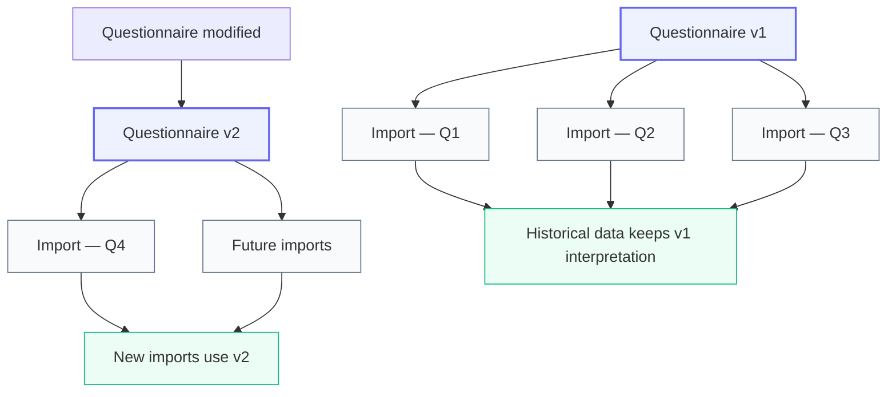
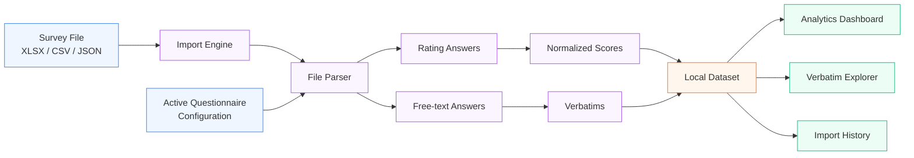
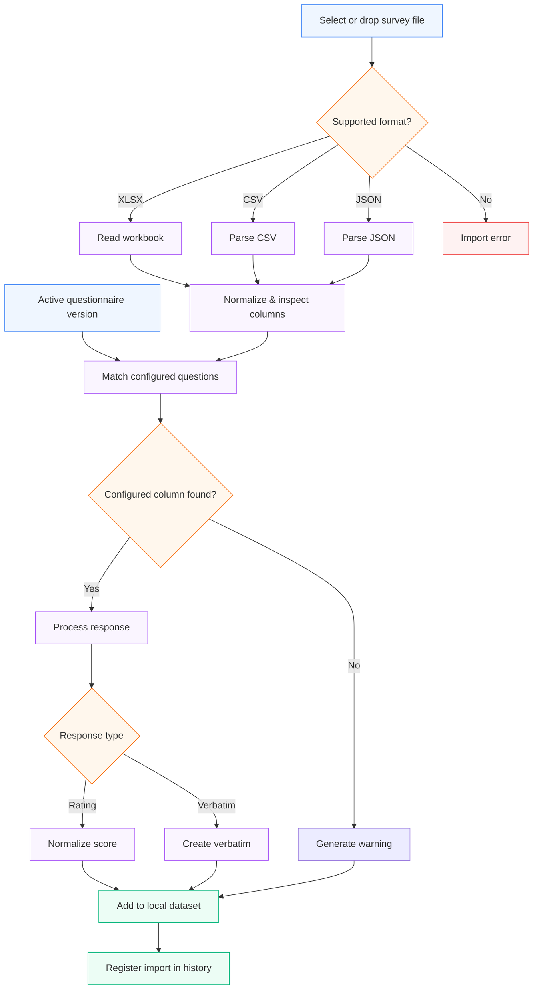
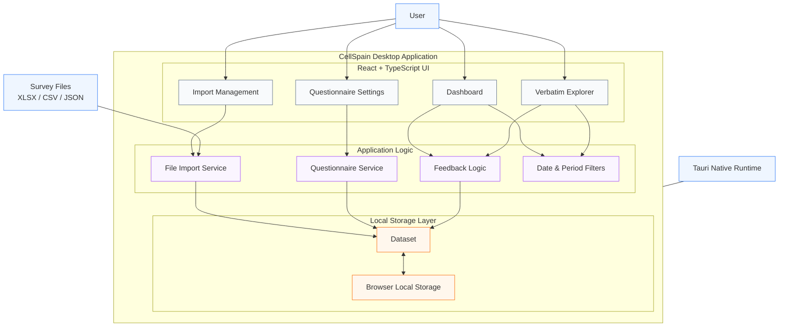
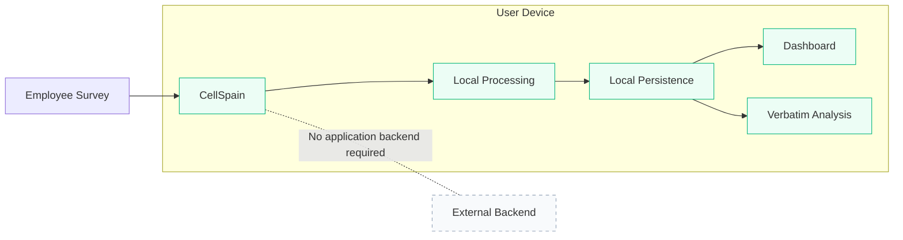
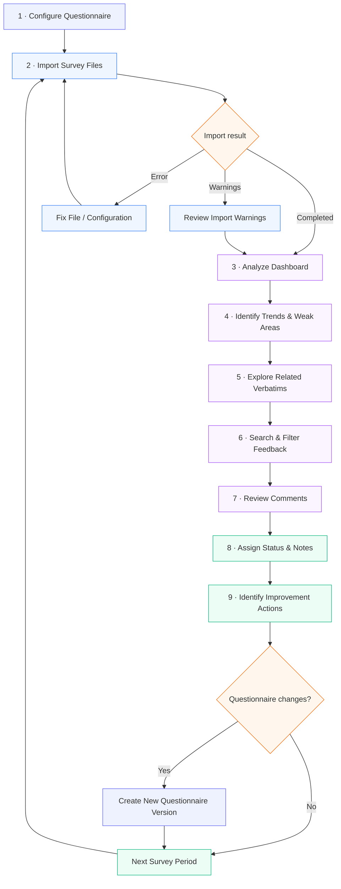

<div align="center">

# 📊 CellSpain

### Employee Feedback Analytics — Local, Flexible and Privacy-First

**CellSpain** is a local-first desktop application designed to transform employee survey exports into clear, actionable insights.

Import survey data, analyze satisfaction trends, explore employee verbatims and adapt questionnaires over time — without sending survey data to an external server.

</div>

---

## 📚 Table of Contents

- [Overview](#-overview)
- [Key Features](#-key-features)
- [How It Works](#-how-it-works)
- [Analytics Dashboard](#-analytics-dashboard)
- [Verbatim Analysis](#-verbatim-analysis)
- [Questionnaire Configuration](#️-questionnaire-configuration)
- [Questionnaire Versioning](#-questionnaire-versioning)
- [Import System](#-import-system)
- [Architecture](#️-architecture)
- [Privacy & Local-First Design](#-privacy--local-first-design)
- [Tech Stack](#️-tech-stack)
- [Project Structure](#-project-structure)
- [Getting Started](#-getting-started)
- [Development](#-development)
- [Testing](#-testing)
- [Typical Workflow](#-typical-workflow)
- [Future Improvements](#-future-improvements)
- [Author](#-author)

---

# 🎯 Overview

Employee satisfaction surveys often generate large spreadsheets containing both:

- quantitative ratings;
- qualitative free-text feedback;
- respondent metadata;
- recurring survey periods.

Manually processing these files can quickly become time-consuming, especially when the questionnaire evolves over time.

**CellSpain** provides a desktop interface to centralize this workflow.

The application can:

- import employee survey files;
- normalize satisfaction ratings;
- calculate satisfaction indicators;
- analyze trends over time;
- group results by category;
- extract and explore employee verbatims;
- track the review status of comments;
- configure questions and categories;
- version questionnaire configurations;
- preserve the interpretation of historical imports.

The goal is to turn raw employee feedback into information that is easier to understand, compare and act upon.

---

# ✨ Key Features

## 📊 Satisfaction Analytics

CellSpain automatically transforms survey ratings into measurable indicators.

The dashboard provides:

- overall average score;
- median score;
- comparison with the previous available period;
- average score by category;
- average score by employee seniority;
- category evolution over time;
- overall satisfaction trends;
- period-to-period comparisons;
- radar-based category comparisons.

Survey responses are normalized onto a common **1–4 scale**.

For example:

| Survey Answer | Score |
|---|---:|
| `No way` | 1 |
| `Meh` / `Bof` | 2 |
| `OK` | 3 |
| `Great` / `Top` / `Top!` | 4 |

This makes it possible to compare results consistently across questions and survey periods.

---

## 💬 Verbatim Analysis

Free-text answers are automatically extracted as **verbatims**.

Each verbatim can contain contextual information such as:

- the original question;
- associated category;
- related rating;
- sentiment;
- response date;
- employee role;
- employee seniority;
- source file;
- source sheet;
- review status;
- internal notes.

Comments can then be searched and filtered directly from the application.

Available filters include:

- keyword search;
- sentiment;
- category;
- review status;
- month;
- year;
- custom date range.

---

## 🗂️ Feedback Review Workflow

Each verbatim can be manually reviewed and assigned a status.

Available statuses are:

```text
New
To review
Done
Ignored
```

Internal notes can also be attached to individual verbatims.

This creates a lightweight workflow for tracking which employee comments:

- still need attention;
- require further analysis;
- have already been handled;
- can be ignored.

---

## ⚙️ Dynamic Questionnaire Configuration

The questionnaire does not need to remain permanently hard-coded.

Users can configure questions and categories directly from the application.

This allows CellSpain to evolve when the source employee survey changes.

Users can:

- create categories;
- rename categories;
- add category descriptions;
- enable or disable categories;
- delete categories;
- create questions;
- map questions to categories;
- specify the expected source column;
- define the question response type;
- enable or disable individual questions.

Supported question types are:

```text
Rating
Free text / Verbatim
```

---

## 🧬 Versioned Questionnaire System

One of the core design principles of CellSpain is:

> **Changing the questionnaire must never silently reinterpret historical data.**

Every saved questionnaire modification creates a new configuration version.

Existing imports remain associated with the configuration that was active when they were processed.



For example, if a question changes category:

```text
Version 1

"Are you satisfied with your manager?"
        ↓
Management
```

and later becomes:

```text
Version 2

"Are you satisfied with your manager?"
        ↓
Work Environment
```

previous imports still keep the original **Management** mapping.

Only future imports use the new mapping.

This makes historical comparisons much safer and prevents configuration changes from unexpectedly modifying existing analysis.

---

# 🔄 How It Works

At a high level, CellSpain transforms raw survey exports into structured analytics and qualitative feedback.



The import system uses the active questionnaire configuration to determine how columns should be interpreted.

Rating questions become numerical answers.

Free-text questions become verbatims.

The resulting structured dataset is then used by the dashboard and feedback explorer.

---

# 📊 Analytics Dashboard

The main dashboard gives an overview of the imported employee satisfaction data.

## Global Indicators

CellSpain calculates indicators such as:

```text
Average Score
Median Score
Evolution vs Previous Period
```

These metrics are derived directly from the currently filtered dataset.

---

## Average by Category

Answers are grouped into configurable categories.

Default categories include areas such as:

```text
Work environment
Missions
Events
Development
Salary
POM
Material
Proudness
```

These categories can later be modified through the questionnaire configuration.

---

## Seniority Analysis

When seniority information is available in the imported survey, CellSpain can compare satisfaction levels across employee seniority groups.

This helps identify whether employee experience differs depending on how long someone has been working at the company.

---

## Trend Analysis

Survey responses are grouped into calendar quarters:

```text
Q1
Q2
Q3
Q4
```

Trend charts can then show how overall satisfaction and individual categories evolve over time.

This makes it easier to identify:

- improving areas;
- declining areas;
- recurring issues;
- long-term patterns.

---

## Radar Comparison

Radar charts provide a visual comparison of satisfaction categories between survey periods.

They help quickly identify where category scores have improved or deteriorated.

---

# 💬 Verbatim Analysis

Quantitative indicators explain **what is happening**.

Verbatims help explain **why it is happening**.

The Verbatim Explorer provides access to free-text employee feedback extracted during import.

A verbatim can contain:

```text
Comment
Question
Category
Score
Sentiment
Date
Role
Seniority
Source file
Review status
Internal note
```

---

## Search & Filtering

Users can search through comments using keywords or phrases.

Additional filters make it possible to narrow the results by:

```text
Sentiment
Category
Review status
Period
```

Date filtering supports:

```text
All data
Month
Year
Custom period
```

This allows users to move from a global dashboard metric to the individual comments behind it.

---

# ⚙️ Questionnaire Configuration

The questionnaire configuration page allows the import logic to evolve without requiring source-code modifications for every survey change.

---

## Categories

Each category contains a stable internal identifier and configurable metadata.

A category can define:

```text
Name
Description
Active / Inactive status
```

Users can:

- add categories;
- rename categories;
- disable categories;
- remove categories.

Deleting a category also removes its linked questions from the next configuration version.

---

## Questions

Each configured question contains information used by the import engine.

Conceptually:

```text
Question
│
├── Stable identifier
├── Display label
├── Expected source column
├── Category
├── Response type
└── Active status
```

The expected source column can be defined using a column header.

The import logic also supports Excel-style column references such as:

```text
B
U
AA
```

---

## Stable Question Identifiers

Questions use stable internal identifiers.

These identifiers make it possible to preserve the logical identity of a question even if its:

- display label changes;
- category changes;
- source column changes.

This is important for maintaining consistent configuration history.

---

## Configuration Validation

Before saving or importing a questionnaire configuration, validation rules help prevent ambiguous setups.

For example, the application checks for situations such as:

- duplicate stable identifiers;
- multiple active questions using the same source column;
- questions linked to invalid categories;
- malformed imported configurations.

This reduces the risk of incorrect data interpretation during future imports.

---

# 📤 Questionnaire Import / Export

Questionnaire configurations can be exported as JSON.

Example:

```text
cellspain-questionnaire-v2.json
```

A configuration can later be imported again.

Imported configurations are activated as a **new version**, rather than silently replacing historical configurations.

This can be useful for:

- backing up questionnaire setups;
- sharing configurations;
- restoring previous structures;
- preparing a configuration for a future survey.

---

# 📥 Import System

Survey files can be imported using:

- drag & drop;
- the native file picker.

Supported formats:

```text
.xlsx
.csv
.json
```

---

## Import Pipeline



---

## Resilient Imports

Unexpected questionnaire changes should not necessarily prevent an entire survey file from being imported.

When using an explicit questionnaire configuration:

- known configured columns are processed;
- missing configured columns generate warnings;
- unknown columns can generate warnings;
- inactive questions are ignored;
- questions linked to inactive categories are ignored.

This allows CellSpain to remain usable when survey exports change slightly.

---

## Header Normalization

The parser handles common formatting differences in spreadsheet headers.

For example:

```text
"Manager Trust"
" manager trust "
"MANAGER TRUST"
```

can still be interpreted as the same logical column.

This reduces failures caused by minor formatting differences in exported spreadsheets.

---

## Import History

Every attempted import is recorded in the import history.

An import can contain information such as:

```text
File name
Status
Import date
File size
Processed rows
Detected verbatims
Warnings
Questionnaire configuration version
```

Imports can have statuses such as:

```text
Completed
Error
```

Completed imports can also be removed.

When removing a completed import, the associated imported answers and verbatims are removed from the local dataset as well.

---

# 🏗️ Architecture

CellSpain is built as a **Tauri desktop application** with a React frontend.

The application is organized around feature-specific services and local data persistence.



---

## Frontend Layer

The frontend is built with:

```text
React
TypeScript
Vite
```

React manages the user interface while TypeScript provides strongly typed application logic.

---

## Application Services

Business logic is separated into feature-oriented modules.

Main responsibilities include:

### File Service

Responsible for:

- reading imported files;
- interpreting workbook data;
- matching configured questions;
- extracting ratings;
- extracting verbatims;
- generating import warnings.

### Questionnaire Service

Responsible for:

- configuration validation;
- version creation;
- import/export;
- reset behavior;
- active questionnaire management.

### Feedback Logic

Responsible for:

- score calculations;
- averages;
- median values;
- quarter grouping;
- period ordering;
- visualization helpers.

---

## Local Persistence

The current application dataset is persisted locally using browser `localStorage` inside the Tauri application.

The stored dataset contains:

```text
Answers
Verbatims
Import history
Questionnaire versions
```

This keeps the application functional offline without requiring a backend server.

---

# 🔒 Privacy & Local-First Design

Employee feedback can contain sensitive information.

CellSpain is therefore designed around local processing.



Imported survey data is processed locally by the application.

The current architecture does not require a remote backend to perform survey analysis.

This means the core workflow can operate entirely on the user's machine.

> **Note:** Local-first storage should not be confused with encrypted storage. The current application persists its dataset locally and does not currently implement dedicated encryption-at-rest for survey data.

---

# 🛠️ Tech Stack

## Application

| Technology | Purpose |
|---|---|
| **Tauri 2** | Desktop application runtime |
| **React 19** | User interface |
| **TypeScript** | Type-safe application logic |
| **Vite 7** | Development server and frontend build |
| **Rust** | Native Tauri application layer |

---

## Data & Visualization

| Technology | Purpose |
|---|---|
| **SheetJS / XLSX** | Spreadsheet parsing |
| **Recharts** | Charts and data visualization |
| **TanStack Table** | Table tooling |
| **Zod** | Schema validation |
| **Zustand** | State-management dependency |
| **Lucide React** | Interface icons |

---

## Tauri Plugins

The project includes Tauri integrations for:

```text
Filesystem access
Native opening capabilities
SQL capabilities
```

The current application dataset itself is still persisted through local storage.

---

## Testing

| Technology | Purpose |
|---|---|
| **Vitest** | Automated unit testing |

---

# 📁 Project Structure

A simplified overview of the project:

```text
CellSpain/
│
├── public/
│
├── src/
│   │
│   ├── assets/
│   │
│   ├── features/
│   │   │
│   │   ├── feedback/
│   │   │   ├── feedback.service.ts
│   │   │   ├── feedback.store.ts
│   │   │   └── feedback.types.ts
│   │   │
│   │   ├── files/
│   │   │   ├── file.service.ts
│   │   │   ├── file.service.test.ts
│   │   │   └── file.types.ts
│   │   │
│   │   └── settings/
│   │       ├── QuestionnaireSettings.tsx
│   │       ├── questionnaire.service.ts
│   │       ├── questionnaire.service.test.ts
│   │       ├── questionnaire.types.ts
│   │       └── settings.store.ts
│   │
│   ├── shared/
│   │   ├── db/
│   │   └── utils/
│   │
│   ├── App.tsx
│   ├── App.css
│   └── main.tsx
│
├── src-tauri/
│   ├── capabilities/
│   ├── icons/
│   ├── src/
│   ├── Cargo.toml
│   └── tauri.conf.json
│
├── package.json
├── package-lock.json
├── tsconfig.json
├── vite.config.ts
└── README.md
```

The application follows a feature-oriented organization.

```text
features/files
    ↓
Survey parsing and imports

features/feedback
    ↓
Analytics and verbatim logic

features/settings
    ↓
Questionnaire configuration and filters

shared/db
    ↓
Local dataset persistence
```

---

# 🚀 Getting Started

## Prerequisites

Before running CellSpain locally, make sure you have:

```text
Node.js
npm
Rust
Cargo
Tauri system dependencies
```

The exact native dependencies required by Tauri depend on your operating system.

---

## 1. Clone the repository

```bash
git clone https://github.com/nathanda95/CellSpain.git
cd CellSpain
```

---

## 2. Install dependencies

```bash
npm install
```

---

## 3. Run the desktop application

```bash
npm run tauri dev
```

This will:

```text
Start the Vite development server
        ↓
Compile the Tauri application
        ↓
Launch CellSpain as a desktop application
```

---

# 💻 Development

## Frontend-only Development

The React frontend can be started independently with:

```bash
npm run dev
```

The development server is configured to run on:

```text
http://localhost:1420
```

This mode can be useful when working primarily on the user interface.

---

## Production Frontend Build

```bash
npm run build
```

This runs TypeScript compilation followed by the Vite production build.

---

## Desktop Build

To generate a production desktop bundle:

```bash
npm run tauri build
```

Tauri will generate the appropriate application bundle for the target platform.

---

# 🧪 Testing

CellSpain uses **Vitest** for automated tests.

Run the test suite with:

```bash
npm test
```

Current tests cover important questionnaire and import behaviors such as:

- immutable questionnaire version creation;
- stable question identifiers;
- category mapping;
- configuration import/export;
- malformed configuration rejection;
- duplicate configuration detection;
- normalized spreadsheet headers;
- Excel column references;
- missing configured columns;
- unknown column warnings;
- inactive categories;
- historical automatic detection compatibility.

These tests are particularly important because the application's import behavior must remain predictable even as questionnaires evolve.

---

# 🔁 Typical Workflow

A typical CellSpain workflow looks like this:



This creates a continuous feedback cycle:

```text
Collect
   ↓
Analyze
   ↓
Understand
   ↓
Act
   ↓
Adapt
   ↓
Collect again
```

---

# 🧭 Design Principles

CellSpain is built around several core principles.

## 1. Historical Data Must Stay Stable

Changing today's questionnaire should not silently change yesterday's analysis.

Questionnaire versioning protects historical interpretation.

---

## 2. Survey Changes Should Not Break the Application

The questionnaire configuration allows questions and categories to evolve without requiring the entire import pipeline to be rewritten.

---

## 3. Quantitative and Qualitative Feedback Belong Together

A satisfaction score alone does not explain the reason behind it.

CellSpain connects numerical indicators with employee verbatims to provide more context.

---

## 4. Data Should Stay Close to the User

The application is designed to work locally without requiring a remote analysis backend.

---

## 5. Imports Should Be Understandable

When something unexpected happens during an import, the user should receive warnings instead of having data silently ignored whenever possible.

---

# 🗺️ Future Improvements

Possible future improvements include:

### 💾 Persistence

- migrate the main dataset from localStorage to SQLite;
- add structured database migrations;
- improve storage scalability for larger survey histories.

### 🧠 Text Analysis

- advanced sentiment analysis;
- automatic topic detection;
- recurring-theme extraction;
- keyword clustering;
- AI-assisted verbatim summaries.

### 📊 Analytics

- more advanced employee segmentation;
- cross-country comparisons;
- configurable scoring scales;
- additional trend visualizations;
- custom dashboard metrics.

### 📤 Reporting

- PDF report generation;
- Excel report export;
- automated executive summaries;
- presentation-ready dashboard exports.

### 🔄 Import Intelligence

- automatic questionnaire schema detection;
- question-mapping suggestions;
- improved import diagnostics;
- preview before confirming an import.

### 🔐 Privacy

- optional encrypted local storage;
- configurable data retention;
- secure dataset export/import.

---

# 👤 Author

**Nathan Daligault**

GitHub: `@nathanda95`

---

<div align="center">

### 📊 From raw survey data to actionable employee insights.

**CellSpain**

*Local analysis · Flexible questionnaires · Historical consistency*

</div>
